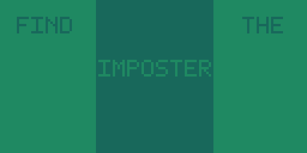
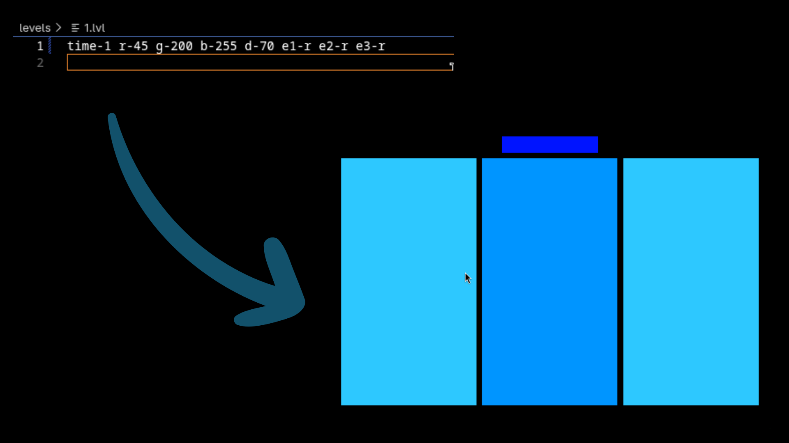

Imposter is a color difrence game based in python. 

## level loading
for example the line `time-1 r-45 g-200 b-255 d-70 e1-r e2-r e3-r` will run like this:


``` 
time-1 how match time will he pice last
r,g,b the main color of the elements
d-70 the difficulty of the pice
e1,e2,e3 the elements (r for rect and c for circle)
```

# installation

## linux :3

depending on the flavor the steps mit be a bit difrent.
you will need to install `python` and `pygame`
run `git clone https://github.com/thearmadiliking/imposter`

## windows :(

you will need to install `python` and `pygame`
run `git clone https://github.com/thearmadiliking/imposter`

## installer

run `git clone https://github.com/thearmadiliking/imposter` and use the installer (maker.py)